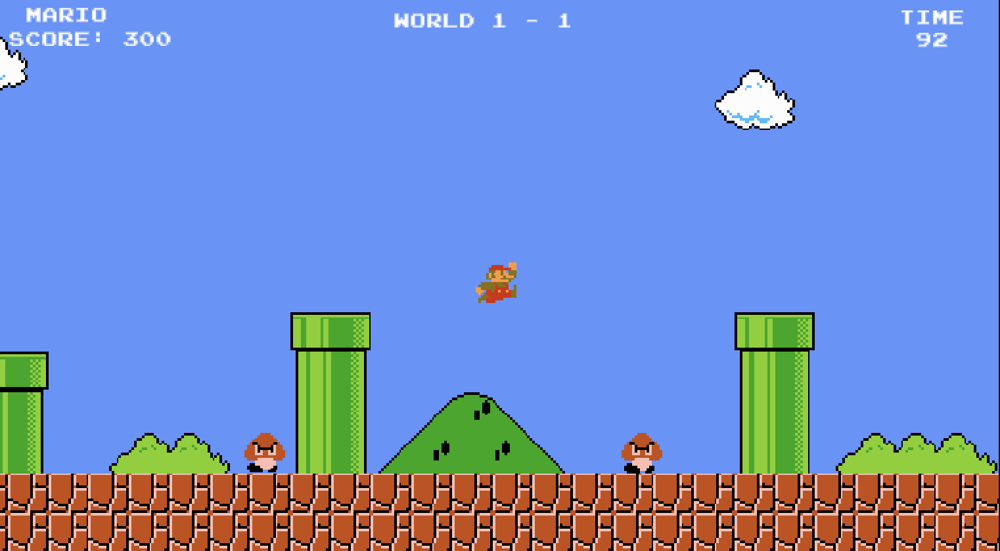
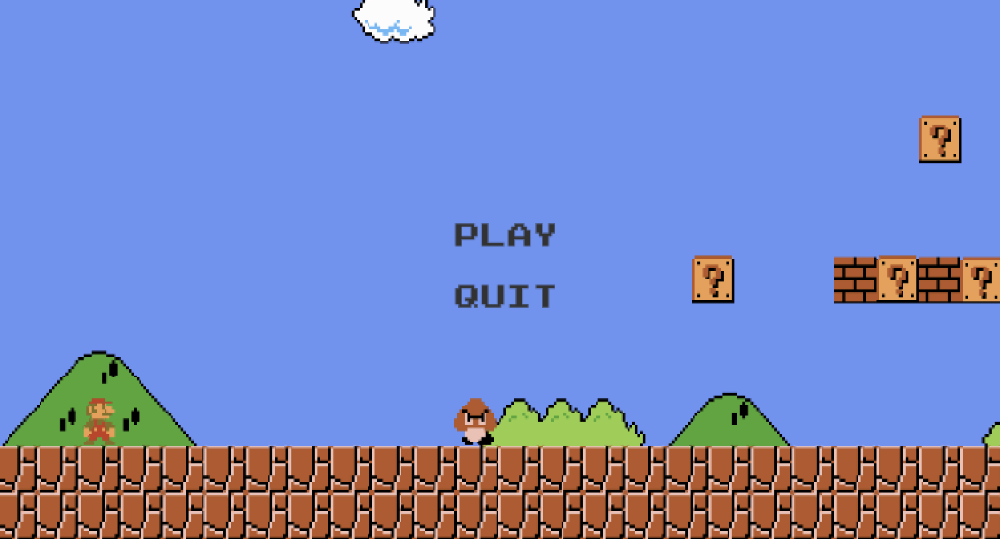

# Super Mario Clone – Endless 1-1 Loop

This is a personal project where I recreated a simple Super Mario clone in Unity. The game includes a Main Menu and the classic World 1-1, which loops infinitely. A fun way to experiment with game development and platformer mechanics!

# IMPORTANT
Unity reported a problem for this editor version. Be careful downloading this repository. I have lost the access and i cant manually change it.
For more information: https://unity.com/security/sept-2025-01

**Game**

**MainMenu**

